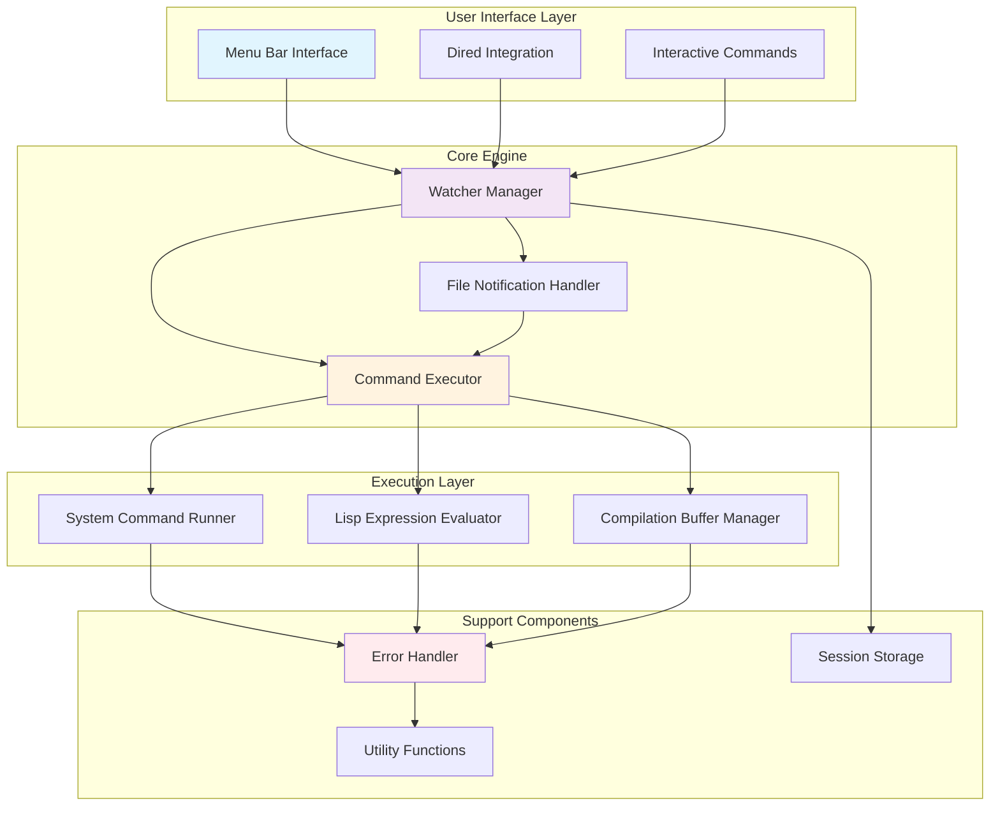

# WatcherRun.el - Architecture Overview

## High-Level Architecture Diagram

## Component Summary

- **Menu Bar Interface**: Traditional Emacs menu for managing watchers - list, add, delete, and modify watchers
- **Dired Integration**: Allows users to mark files/directories in Dired and create watchers directly
- **Interactive Commands**: Command-line interface for adding watchers by typing file/directory paths
- **Watcher Manager**: Central coordinator that manages all active watchers and their lifecycle
- **File Notification Handler**: Wrapper around Emacs' native file-notify API to monitor file changes
- **Command Executor**: Dispatches execution to appropriate runners based on command type
- **System Command Runner**: Executes system commands asynchronously using Emacs' async capabilities
- **Lisp Expression Evaluator**: Safely evaluates Emacs Lisp expressions in the current context
- **Compilation Buffer Manager**: Handles renaming of compilation buffers to support multiple concurrent compilations
- **Error Handler**: Captures and displays errors in a dedicated buffer for debugging
- **Session Storage**: In-memory storage for watcher configurations (session-only persistence)
- **Utility Functions**: Helper functions for file path handling, validation, and common operations

## Tech Stack Summary

- **Emacs Lisp**: Primary language for the entire package, ensuring native integration and cross-platform compatibility
- **file-notify.el**: Emacs' built-in file notification library for watching file changes across different operating systems
- **async.el**: Emacs' asynchronous execution framework for running system commands without blocking the editor
- **easy-menu.el**: Emacs' traditional menu creation system for building the management interface
- **dired.el**: Integration with Emacs' directory editor for file selection and marking
- **compile.el**: Integration with Emacs' compilation system for managing multiple compilation buffers

## Architecture Rationale

This **modular monolithic architecture** is chosen because:

1. **Simplicity**: All components are in one package, making installation and maintenance straightforward
2. **Native Integration**: Uses only Emacs native APIs, ensuring compatibility across all platforms where Emacs runs
3. **Performance**: Direct function calls between modules without IPC overhead
4. **Maintainability**: Clear separation of concerns while keeping everything in one codebase
5. **Emacs Philosophy**: Follows traditional Emacs package design patterns that users expect

The architecture prioritizes reliability and user experience by:
- Using session-only storage to avoid file corruption issues
- Implementing comprehensive error handling with dedicated error buffers
- Supporting both immediate and recursive directory watching based on user choice
- Managing compilation buffer naming to prevent conflicts
