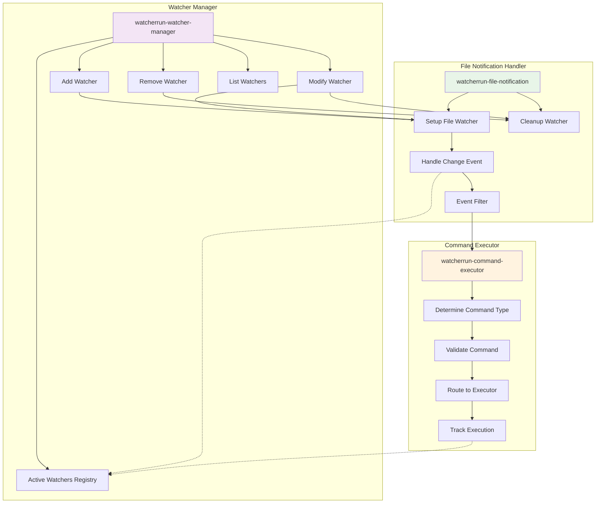

# Core Engine - Component Details

## Component-Specific Diagram



## Detailed Description

### Watcher Manager

The **Watcher Manager** is the central coordinator of the entire system. It maintains the registry of all active watchers and provides the primary API for the user interface layer.

#### Core Data Structure:
```elisp
;; Each watcher is represented as:
(defstruct watcherrun-watcher
  id              ; Unique identifier
  paths           ; List of watched file/directory paths
  command         ; Command string to execute
  command-type    ; 'system or 'lisp
  recursive       ; Boolean for directory watching
  file-descriptor ; File notification descriptor
  last-executed   ; Timestamp of last execution
  execution-count ; Number of times executed
  status)         ; 'active, 'paused, 'error
```

#### Key Functions:

**`watcherrun-add-watcher (paths command command-type recursive)`**
- Validates input parameters
- Creates new watcher structure with unique ID
- Registers with File Notification Handler
- Stores in active watchers registry
- Returns watcher ID for reference

**`watcherrun-remove-watcher (watcher-id)`**
- Finds watcher by ID
- Stops file notification
- Cleans up resources
- Removes from registry
- Updates menu state

**`watcherrun-modify-watcher (watcher-id new-command)`**
- Stops current watcher
- Updates command while preserving other settings
- Restarts with new command
- Maintains same watcher ID for consistency

**`watcherrun-list-watchers ()`**
- Returns formatted list of all active watchers
- Shows path, command, type, and status
- Used by menu interface for display

#### Registry Management:
- Uses hash table for O(1) watcher lookup by ID
- Maintains separate index by file path for conflict detection
- Automatically generates unique IDs using timestamp + counter
- Provides cleanup functions for session end

### File Notification Handler

The **File Notification Handler** wraps Emacs' native `file-notify` API to provide a clean interface tailored for WatcherRun's needs.

#### Core Functionality:

**`watcherrun-setup-file-watcher (paths recursive callback)`**
- Iterates through all provided paths
- Uses `file-notify-add-watch` for each path
- Handles both files and directories appropriately
- Sets up recursive watching when requested
- Returns file notification descriptor

**`watcherrun-handle-change-event (event)`**
This is the callback function that gets triggered when files change:
```elisp
;; Event structure: (descriptor action file [file1])
;; Actions: created, deleted, changed, renamed
(defun watcherrun-handle-change-event (event)
  (let* ((descriptor (nth 0 event))
         (action (nth 1 event))
         (file (nth 2 event))
         (watcher (watcherrun-find-watcher-by-descriptor descriptor)))
    (when (and watcher (watcherrun-should-execute-p action))
      (watcherrun-execute-command watcher file))))
```

**Event Filtering:**
- Filters out temporary files (ending in ~, .tmp, etc.)
- Ignores hidden files (starting with .) unless explicitly requested
- Debounces rapid-fire events (multiple changes within 100ms)
- Only responds to 'changed, 'created, and 'renamed events

**Cleanup Management:**
- Tracks all active file descriptors
- Provides cleanup function for graceful shutdown
- Handles errors when files/directories are deleted
- Automatically restarts watchers when directories are recreated

### Command Executor

The **Command Executor** serves as the dispatcher that routes commands to the appropriate execution layer based on their type.

#### Command Type Detection:
```elisp
(defun watcherrun-determine-command-type (command)
  "Intelligently determine if command is system or lisp."
  (cond
   ((string-match-p "^(" command) 'lisp)     ; Starts with parenthesis
   ((string-match-p "compile\\|make\\|npm" command) 'system)
   (t 'system)))  ; Default to system command
```

#### Validation Layer:
**System Commands:**
- Checks if command executable exists in PATH
- Validates command syntax
- Warns about potentially dangerous commands

**Lisp Expressions:**
- Uses `read` to parse Lisp syntax
- Validates that functions exist and are callable
- Sandboxes dangerous operations

#### Execution Routing:
**`watcherrun-execute-command (watcher file-path)`**
1. Updates watcher statistics (last-executed, execution-count)
2. Substitutes placeholders in command ({{file}}, {{dir}}, etc.)
3. Routes to appropriate executor based on command-type
4. Handles execution errors and updates watcher status

#### Placeholder Substitution:
Commands can include placeholders that get replaced with actual values:
- `{{file}}`: Full path of the changed file
- `{{filename}}`: Just the filename without path
- `{{dir}}`: Directory containing the file
- `{{ext}}`: File extension
- `{{basename}}`: Filename without extension

#### Error Integration:
- Catches all execution errors
- Routes errors to Error Handler component
- Updates watcher status to indicate problems
- Provides detailed error context for debugging

### Inter-Component Communication

The Core Engine components work together seamlessly:

1. **User Interface → Watcher Manager**: All user actions go through the manager's API
2. **Watcher Manager → File Notification**: Manager sets up and tears down file watching
3. **File Notification → Command Executor**: File events trigger command execution
4. **Command Executor → Execution Layer**: Commands are routed to appropriate runners
5. **All Components → Error Handler**: Errors are centrally collected and displayed

This architecture ensures **separation of concerns** while maintaining **tight integration** for performance and reliability.
