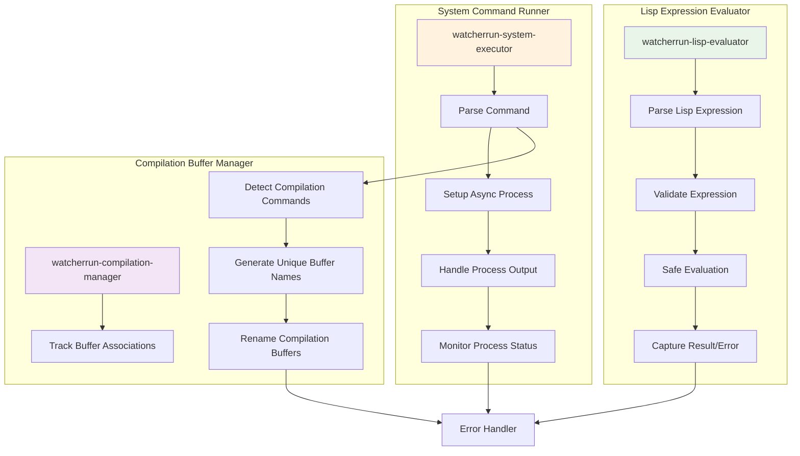

# Execution Layer - Component Details

## Component-Specific Diagram



## Detailed Description

### System Command Runner

The **System Command Runner** handles execution of system commands asynchronously, ensuring that Emacs remains responsive even when running long-running processes.

#### Core Implementation:

**`watcherrun-execute-system-command (command file-path watcher-id)`**
```elisp
(defun watcherrun-execute-system-command (command file-path watcher-id)
  "Execute system command asynchronously with proper error handling."
  (let* ((expanded-command (watcherrun-expand-placeholders command file-path))
         (buffer-name (watcherrun-generate-process-buffer-name watcher-id))
         (process-name (format "watcherrun-%s" watcher-id)))
    
    ;; Check if this is a compilation command
    (if (watcherrun-is-compilation-command-p expanded-command)
        (watcherrun-execute-compilation-command expanded-command watcher-id)
      (watcherrun-execute-regular-command expanded-command buffer-name process-name))))
```

#### Async Process Management:
- Uses `start-process` for true asynchronous execution
- Creates dedicated output buffers for each watcher
- Sets up process sentinels to handle completion/errors
- Implements process cleanup on watcher deletion

#### Process Buffer Management:
**Buffer Naming Convention:**
- Regular commands: `*watcherrun-output-<watcher-id>*`
- Compilation commands: `*compilation-<watcher-name>*`
- Error output: `*watcherrun-errors*`

**Buffer Features:**
- Automatic scrolling to show latest output
- Color coding for different types of output
- Timestamps for each execution
- Option to clear buffer on new execution

#### Command Expansion:
The placeholder expansion system replaces variables in commands:
```elisp
(defun watcherrun-expand-placeholders (command file-path)
  "Replace placeholders in command with actual values."
  (let* ((file-name (file-name-nondirectory file-path))
         (dir-name (file-name-directory file-path))
         (extension (file-name-extension file-path))
         (basename (file-name-sans-extension file-name)))
    
    (replace-regexp-in-string
     "{{\\([^}]+\\)}}"
     (lambda (match)
       (pcase (match-string 1 match)
         ("file" file-path)
         ("filename" file-name)
         ("dir" dir-name)
         ("ext" extension)
         ("basename" basename)
         (_ match)))  ; Return unchanged if unknown placeholder
     command)))
```

### Lisp Expression Evaluator

The **Lisp Expression Evaluator** safely executes Emacs Lisp expressions within the context of file changes, providing access to Emacs' full functionality.

#### Safe Evaluation Framework:

**`watcherrun-evaluate-lisp-expression (expression file-path watcher-id)`**
```elisp
(defun watcherrun-evaluate-lisp-expression (expression file-path watcher-id)
  "Safely evaluate Lisp expression with file context."
  (condition-case error
      (let ((file-var file-path)           ; Make file-path available as 'file-var'
            (watcher-id-var watcher-id))   ; Make watcher-id available
        
        ;; Parse the expression
        (let ((parsed-expr (read expression)))
          
          ;; Validate it's safe to execute
          (when (watcherrun-validate-lisp-expression parsed-expr)
            
            ;; Execute in controlled environment
            (eval parsed-expr))))
    
    (error
     (watcherrun-log-error watcher-id 
                          (format "Lisp evaluation error: %s" error)))))
```

#### Security and Safety:
**Expression Validation:**
- Blacklists dangerous functions (`delete-file`, `shell-command`, etc.)
- Prevents infinite loops through timeout mechanism
- Sandboxes file system access
- Validates function existence before execution

**Forbidden Operations:**
```elisp
(defvar watcherrun-forbidden-functions
  '(delete-file delete-directory shell-command
    kill-emacs save-buffers-kill-emacs
    eval-expression shell-command-to-string)
  "Functions that are not allowed in watcher expressions.")
```

#### Context Variables:
When evaluating Lisp expressions, these variables are automatically available:
- `file-var`: Full path to the changed file
- `watcher-id-var`: ID of the current watcher
- `change-time`: Timestamp of the file change
- `buffer-context`: Current buffer when file changed (if applicable)

#### Common Use Cases:
**Compilation and Building:**
```elisp
(compile "make -C ~/my-project")
```

**Buffer Management:**
```elisp
(when (string-suffix-p ".el" file-var)
  (load-file file-var)
  (message "Reloaded %s" file-var))
```

**Custom Notifications:**
```elisp
(message "File %s was modified at %s" 
         (file-name-nondirectory file-var)
         (format-time-string "%H:%M:%S"))
```

### Compilation Buffer Manager

The **Compilation Buffer Manager** solves the specific problem mentioned in the project spec: managing multiple compilation processes by automatically renaming their buffers.

#### Compilation Detection:
```elisp
(defun watcherrun-is-compilation-command-p (command)
  "Determine if command should use compilation mode."
  (or (string-match-p "\\b\\(make\\|compile\\|build\\|test\\)\\b" command)
      (string-match-p "\\b\\(npm\\|yarn\\|cargo\\|go\\)\\s-+\\(run\\|build\\|test\\)" command)
      (string-prefix-p "compile" command)))  ; Direct compile function calls
```

#### Buffer Naming Strategy:
**Automatic Renaming Process:**
1. **Detect Compilation**: Check if command will create a `*compilation*` buffer
2. **Generate Unique Name**: Create name like `*compilation-watcher-001*`
3. **Monitor Buffer Creation**: Watch for new `*compilation*` buffer
4. **Immediate Rename**: Rename buffer as soon as it's created
5. **Track Association**: Link renamed buffer to watcher for cleanup

**Implementation:**
```elisp
(defun watcherrun-execute-compilation-command (command watcher-id)
  "Execute compilation command with automatic buffer renaming."
  (let ((target-buffer-name (format "*compilation-watcher-%s*" watcher-id)))
    
    ;; Set up buffer rename hook
    (add-hook 'compilation-start-hook 
              `(lambda (proc)
                 (when (string= (buffer-name) "*compilation*")
                   (rename-buffer ,target-buffer-name t)
                   (watcherrun-track-compilation-buffer ,target-buffer-name ,watcher-id))))
    
    ;; Execute the compilation
    (compile command)
    
    ;; Clean up hook after brief delay
    (run-with-timer 1.0 nil 
                    (lambda ()
                      (remove-hook 'compilation-start-hook 'watcherrun-buffer-rename-hook)))))
```

#### Buffer Lifecycle Management:
- **Creation**: Automatically rename compilation buffers
- **Tracking**: Maintain association between watchers and their buffers
- **Cleanup**: Remove buffers when watchers are deleted
- **Reuse**: Allow same watcher to create multiple compilation sessions

#### Integration with Emacs Compilation Mode:
- Preserves all compilation mode features (error navigation, etc.)
- Maintains proper compilation buffer history
- Supports compilation mode keybindings and functions
- Works with external tools like `next-error` and `previous-error`

### Error Handling Integration

All execution layer components integrate with the central error handling system:

**Error Categories:**
- **Process Errors**: System command failures, exit codes
- **Evaluation Errors**: Lisp expression syntax/runtime errors  
- **Buffer Errors**: Compilation buffer creation/naming issues
- **Resource Errors**: Out of memory, too many processes

**Error Reporting:**
- Detailed error messages with context
- Stack traces for Lisp evaluation errors
- Process exit codes and signals for system commands
- Timestamps and watcher IDs for all errors

This execution layer ensures **reliable command execution** while maintaining **Emacs responsiveness** and providing **comprehensive error feedback** to help users debug their watcher configurations.
