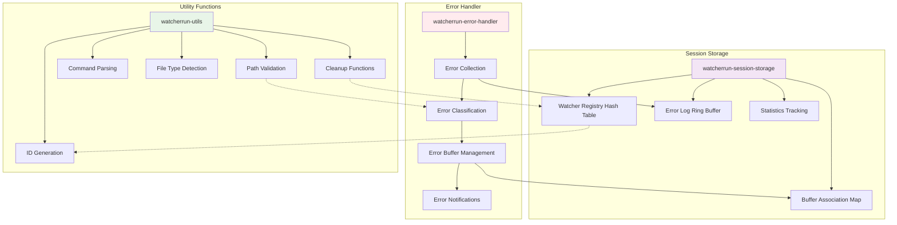

# Support Components - Component Details

## Component-Specific Diagram



## Detailed Description

### Error Handler

The **Error Handler** provides comprehensive error management for the entire WatcherRun system, ensuring users can easily diagnose and fix issues with their watchers.

#### Error Collection System:

**`watcherrun-log-error (watcher-id error-type message &optional context)`**
```elisp
(defun watcherrun-log-error (watcher-id error-type message &optional context)
  "Log error with full context for debugging."
  (let ((error-entry (list
                      :timestamp (current-time)
                      :watcher-id watcher-id
                      :error-type error-type
                      :message message
                      :context context
                      :stack-trace (when (eq error-type 'lisp-error)
                                    (backtrace-to-string)))))
    
    ;; Add to error log
    (ring-insert watcherrun-error-log error-entry)
    
    ;; Update error buffer
    (watcherrun-update-error-buffer error-entry)
    
    ;; Show notification if enabled
    (when watcherrun-show-error-notifications
      (watcherrun-show-error-notification error-entry))))
```

#### Error Classification:
**Error Types:**
- `file-error`: File system issues (permission denied, file not found)
- `command-error`: System command execution failures
- `lisp-error`: Emacs Lisp evaluation errors
- `process-error`: Async process management issues
- `validation-error`: User input validation failures
- `internal-error`: Unexpected system errors

#### Dedicated Error Buffer:

**Buffer: `*WatcherRun Errors*`**
The error buffer provides a dedicated space for viewing and managing errors:

```
=== WatcherRun Error Log ===

[2024-01-15 14:32:15] COMMAND-ERROR (Watcher: web-build-001)
Command failed: npm run build
Exit code: 1
Output: ERROR: Module 'react' not found
Context: File changed: /home/user/project/src/App.js
Actions: [R]etry [D]isable Watcher [E]dit Command

[2024-01-15 14:30:42] FILE-ERROR (Watcher: test-runner-002) 
File not found: /home/user/project/test.py
The watched file may have been deleted or moved.
Actions: [U]pdate Path [D]elete Watcher

[2024-01-15 14:28:33] LISP-ERROR (Watcher: custom-action-003)
Error in Lisp expression: (undefined-function my-custom-function)
Expression: (my-custom-function file-var)
Actions: [E]dit Expression [D]isable Watcher
```

#### Buffer Features:
- **Chronological Listing**: Latest errors at the top
- **Color Coding**: Different colors for different error types
- **Interactive Actions**: Single-key commands to fix common issues
- **Context Links**: Jump to relevant files/buffers
- **Search and Filter**: Find specific errors quickly

#### Error Recovery Actions:
**Interactive Recovery Commands:**
- `r`: Retry the failed command
- `d`: Disable the problematic watcher  
- `e`: Edit the command/expression
- `u`: Update file paths
- `c`: Clear this error from log
- `C`: Clear all errors

### Session Storage

The **Session Storage** component manages all runtime data for WatcherRun, providing fast access and automatic cleanup.

#### Core Data Structures:

**Watcher Registry:**
```elisp
(defvar watcherrun-watchers (make-hash-table :test 'equal)
  "Hash table storing all active watchers by ID.")

;; Example watcher structure:
;; Key: "watcher-001"
;; Value: #s(watcherrun-watcher 
;;           id "watcher-001"
;;           paths ("/home/user/src/main.js")
;;           command "npm run build"
;;           command-type 'system
;;           recursive nil
;;           file-descriptor [file-notify-descriptor]
;;           last-executed [timestamp]
;;           execution-count 15
;;           status 'active)
```

**Buffer Association Map:**
```elisp
(defvar watcherrun-buffer-associations (make-hash-table :test 'equal)
  "Maps watcher IDs to their associated buffers.")

;; Example:
;; Key: "watcher-001" 
;; Value: ("*compilation-watcher-001*" "*watcherrun-output-001*")
```

**Error Log Ring Buffer:**
```elisp
(defvar watcherrun-error-log (make-ring 100)
  "Ring buffer storing the last 100 errors.")
```

**Statistics Tracking:**
```elisp
(defvar watcherrun-statistics 
  '(:total-watchers 0
    :total-executions 0
    :total-errors 0
    :session-start-time nil
    :most-active-watcher nil))
```

#### Session Management:

**Initialization:**
```elisp
(defun watcherrun-initialize-session ()
  "Initialize session storage and cleanup any stale data."
  (clrhash watcherrun-watchers)
  (clrhash watcherrun-buffer-associations)
  (setq watcherrun-error-log (make-ring 100))
  (plist-put watcherrun-statistics :session-start-time (current-time)))
```

**Cleanup Functions:**
```elisp
(defun watcherrun-cleanup-session ()
  "Clean up all watchers and resources at session end."
  (maphash (lambda (id watcher)
             (watcherrun-remove-watcher id))
           watcherrun-watchers)
  (watcherrun-cleanup-buffers))
```

#### Performance Optimizations:
- **Hash Tables**: O(1) lookup for watchers and buffers
- **Ring Buffer**: Efficient circular buffer for error history
- **Lazy Cleanup**: Resources cleaned up only when necessary
- **Bulk Operations**: Batch updates for better performance

### Utility Functions

The **Utility Functions** component provides common functionality used throughout the WatcherRun system.

#### Path Validation:

**`watcherrun-validate-path (path)`**
```elisp
(defun watcherrun-validate-path (path)
  "Validate that path exists and is accessible."
  (cond
   ((not (stringp path)) 
    (error "Path must be a string"))
   ((not (file-exists-p path))
    (error "Path does not exist: %s" path))
   ((not (file-readable-p path))
    (error "Path is not readable: %s" path))
   (t path)))  ; Return path if valid
```

**`watcherrun-normalize-path (path)`**
- Expands tildes (`~/`) to home directory
- Resolves symbolic links
- Converts to absolute paths
- Handles Windows/Unix path differences

#### Command Parsing:

**`watcherrun-parse-command (command)`**
```elisp
(defun watcherrun-parse-command (command)
  "Parse command string and extract components."
  (let ((trimmed (string-trim command)))
    (list
     :raw-command trimmed
     :executable (car (split-string trimmed))
     :arguments (cdr (split-string trimmed))
     :has-placeholders (string-match-p "{{.*}}" trimmed)
     :estimated-type (if (string-prefix-p "(" trimmed) 'lisp 'system))))
```

**Command Validation:**
- Checks if system executables exist in PATH
- Validates Lisp expression syntax
- Warns about potentially dangerous operations
- Suggests corrections for common typos

#### ID Generation:

**`watcherrun-generate-unique-id ()`**
```elisp
(defun watcherrun-generate-unique-id ()
  "Generate unique ID for new watcher."
  (let ((base-id (format "watcher-%03d" (hash-table-count watcherrun-watchers)))
        (counter 1))
    (while (gethash base-id watcherrun-watchers)
      (setq base-id (format "watcher-%03d" counter))
      (setq counter (1+ counter)))
    base-id))
```

#### File Type Detection:

**`watcherrun-detect-file-type (path)`**
- Identifies programming languages by extension
- Suggests appropriate commands for common file types
- Provides smart defaults for different project types

**Smart Suggestions:**
```elisp
(defun watcherrun-suggest-command (file-path)
  "Suggest appropriate command based on file type."
  (let ((extension (file-name-extension file-path)))
    (pcase extension
      ("js" "npm run build")
      ("py" "python {{file}}")
      ("el" "(load-file \"{{file}}\")")
      ("md" "pandoc {{file}} -o {{basename}}.html")
      (_ "echo 'File changed: {{file}}'"))))
```

#### Cleanup Functions:

**`watcherrun-cleanup-buffers ()`**
- Removes orphaned output buffers
- Kills stale compilation buffers
- Cleans up process buffers
- Updates buffer associations

**`watcherrun-cleanup-file-watchers ()`**
- Removes file notification descriptors
- Handles cleanup when files are deleted
- Restarts watchers when files are recreated

### Integration and Data Flow

The support components work together to provide a solid foundation:

1. **Error Handler** collects errors from all other components
2. **Session Storage** provides fast data access for the core engine
3. **Utility Functions** are used by all components for common operations
4. **All components** work together to ensure data consistency and system reliability

These components ensure that WatcherRun is **robust**, **performant**, and **easy to debug** when issues arise.
