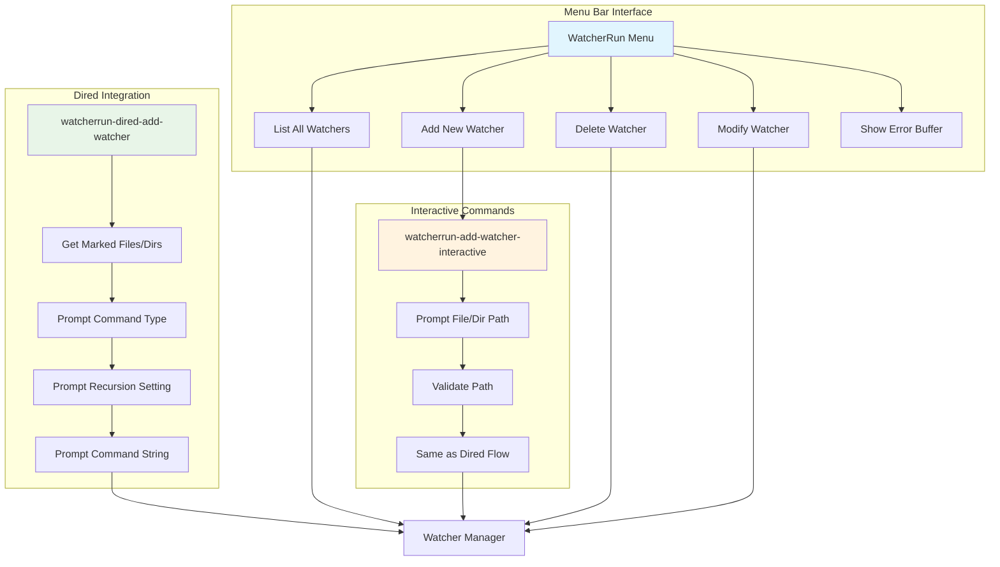

# User Interface Layer - Component Details

## Component-Specific Diagram



## Detailed Description

### Menu Bar Interface

The **Menu Bar Interface** provides a traditional Emacs menu experience using `easy-menu.el`. This is the primary way users will manage their watchers.

#### Key Features:
- **Native Integration**: Uses Emacs' standard menu system that users are familiar with
- **Keyboard Navigation**: Full keyboard support with menu mnemonics (Alt+key combinations)
- **Context Sensitivity**: Menu items enable/disable based on current state (e.g., "Delete Watcher" only available when watchers exist)

#### Menu Structure:
```
WatcherRun
├── List All Watchers        [Ctrl+c w l]
├── Add New Watcher         [Ctrl+c w a]
├── ──────────────────────
├── Delete Watcher          [Ctrl+c w d]
├── Modify Watcher Command  [Ctrl+c w m]
├── ──────────────────────
└── Show Error Buffer       [Ctrl+c w e]
```

#### Implementation Details:
- Uses `easy-menu-define` to create the menu structure
- Each menu item calls a corresponding interactive function
- Menu items are dynamically enabled/disabled using `:enable` clauses
- Keyboard shortcuts are defined using `:keys` for power users

### Dired Integration

The **Dired Integration** allows users to select files and directories directly from the Dired buffer and create watchers for them.

#### Workflow:
1. **File Selection**: User marks files/directories using `m` in Dired
2. **Watcher Creation**: User invokes `watcherrun-dired-add-watcher` (bound to a key)
3. **Command Type Choice**: System prompts: "Execute (s)ystem command or (l)isp expression?"
4. **Recursion Setting**: For directories: "Watch (i)mmediate files only or (r)ecursive?"
5. **Command Input**: User enters the command/expression to execute

#### Key Functions:
- `watcherrun-dired-add-watcher`: Main entry point from Dired
- `dired-get-marked-files`: Retrieves list of marked files/directories
- Input validation ensures all paths exist and are accessible

#### User Experience Enhancements:
- Clear prompts with single-character choices for speed
- Automatic detection of file vs directory to show relevant options
- Visual feedback showing which files/directories will be watched

### Interactive Commands

The **Interactive Commands** provide a command-line interface for users who prefer typing paths directly or want to add watchers without opening Dired.

#### Primary Command: `watcherrun-add-watcher-interactive`
This command guides users through the same process as Dired integration but starts by prompting for the file/directory path.

#### Features:
- **Tab Completion**: Full file path completion using Emacs' built-in completion
- **Path Validation**: Immediate feedback if entered path doesn't exist
- **Same Options**: Identical command type and recursion prompts as Dired mode
- **History**: Maintains history of recently entered paths for quick re-use

#### Error Handling:
- Validates paths before proceeding to command setup
- Provides helpful error messages for common issues (file not found, permission denied)
- Graceful fallback to re-prompt on invalid input

### Integration Points

All three interface components feed into the same **Watcher Manager** backend, ensuring:
- **Consistent Behavior**: Same validation and setup logic regardless of entry point
- **Unified Storage**: All watchers stored in the same session data structure
- **Shared Error Handling**: Common error reporting through the dedicated error buffer

The interface layer is designed to be **beginner-friendly** while offering **power-user efficiency** through keyboard shortcuts and command-line options.
